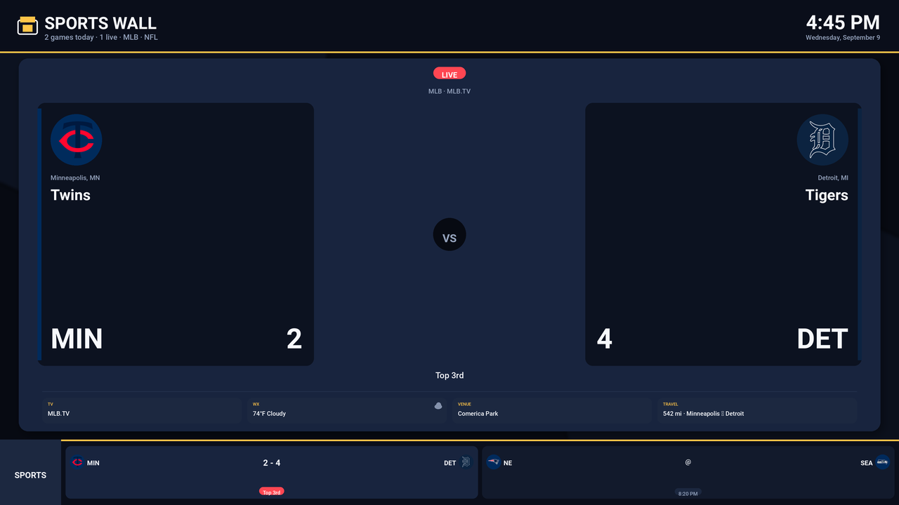
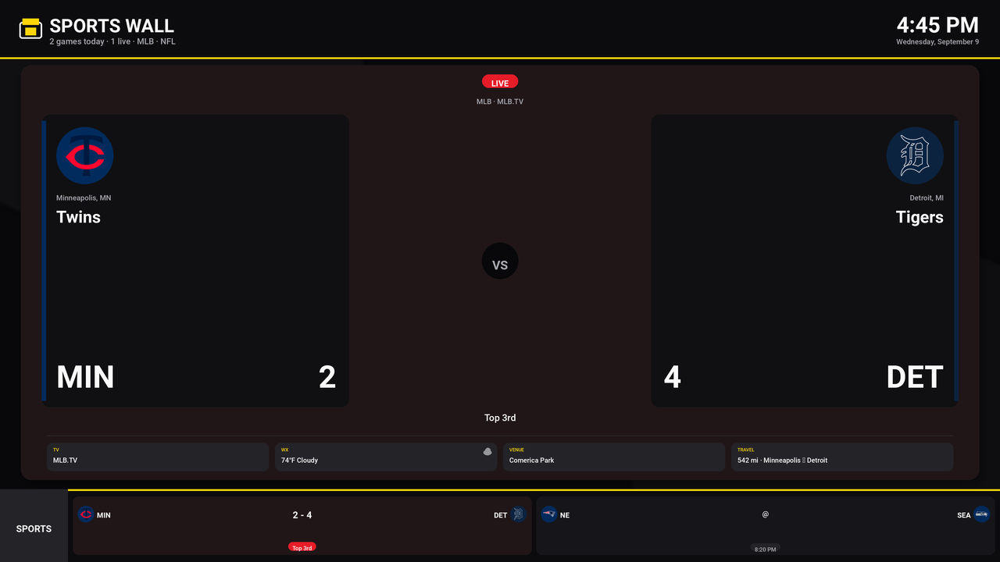
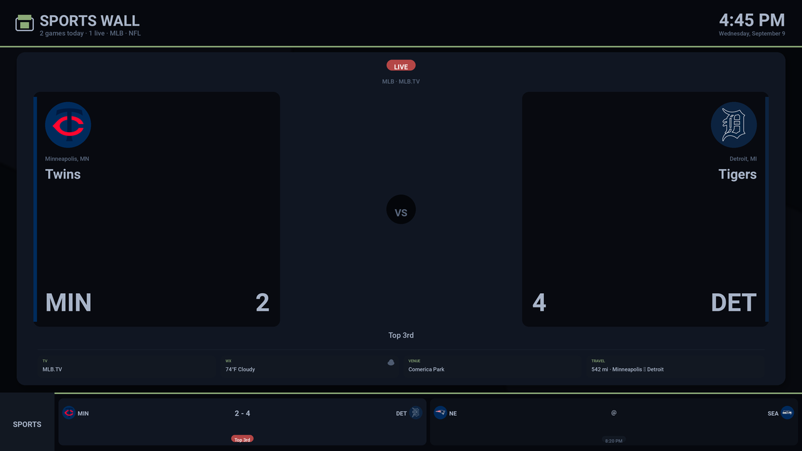
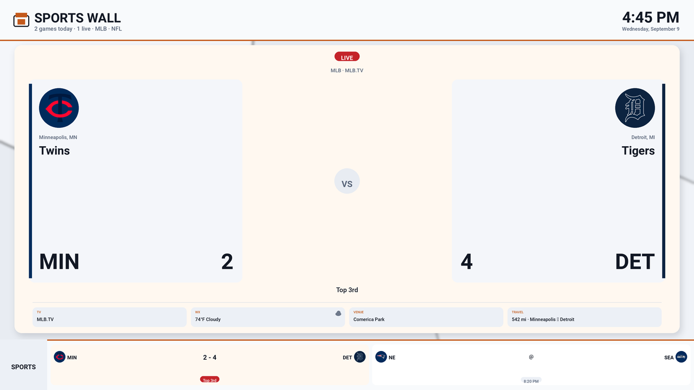

# Sports Wall

A sports display for Home Assistant. Today's games fill a full-screen
board with live scores, weather at the venue, how far the visiting club
travelled, both home cities, and the network carrying the game.

Use it on a television (Chromecast) or a wall-mounted tablet. Same idea
as [Flight Wall](https://github.com/gmisner/ha-flightwall): a dedicated
board for a room, not a dashboard you have to hunt through.

## What it does

- Pulls **NFL, NBA, MLB, and NHL** (college football and basketball are
  optional) from ESPN's public scoreboard. No API key.
- A **featured matchup** in the middle (live game first), with scores,
  venue weather, travel between the two clubs, both cities, and the
  network.
- An **ESPN-style ticker** along the bottom for the rest of today's
  games. The tablet HTML page actually scrolls; the TV image shows the
  same chips in a strip.
- On a TV, writes a 4K board image and Casts it. On a tablet or a
  Chromecast that can run Home Assistant, the **Sportswall** sidebar is
  a live Lovelace markdown board (same pattern as Flight Wall). The
  HTML page still has the animated ticker.

## Themes

The HACS integration has four themes under
**Settings → Devices & Services → Sports Wall → Configure**:

| Theme | Look |
|---|---|
| **Arena night** | Dark navy board, gold accents, team-color stripe |
| **Broadcast** | Black board, yellow scores, red live pill |
| **Night dim** | Same layout, much darker — a bedroom wall |
| **Daylight** | Light board for a bright room |

## Requirements

### Television (HACS)

| Component | Source | Why |
|---|---|---|
| A `media_player` that reports TV on/off | Core (Vizio, webOS, Android TV, …) | Knows the set is on |
| A Google Cast `media_player` on that set | Core | Receives the board image |

Home Assistant should be reachable over **HTTPS** (Nabu Casa or
`external_url`) so Cast can discover it. The board image is served on
the LAN as `/local/sportswall-board.png`.

No other sports integration is required. Scores come from ESPN; weather
fallbacks come from Open-Meteo.

### Tablet (same HACS install)

A browser or [Fully Kiosk](https://www.fully-kiosk.com/) on a wall
tablet. Open **Sportswall** in the sidebar (`/sports-wall/board`) for
the live Lovelace board, or
`http://YOUR_HA:8123/local/sportswall/board.html` for the animated HTML
ticker.

## Installation

1. HACS → three dots → **Custom repositories** →
   `https://github.com/gmisner/ha-sportswall` → type **Integration** →
   Add.
2. Find **Sports Wall** in HACS and download it. Restart Home Assistant.
3. **Settings → Devices & Services → Add integration → Sports Wall.**
   Pick the leagues to show. For a TV, also pick the power
   `media_player` and the Chromecast `media_player` on that set.
4. Leave `switch.sportswall_tv` on. Put it on a dashboard if someone
   will want Netflix or another app in that room. While the switch is
   on, turning the TV on with the remote starts Cast. If they then
   switch to another source, Sports Wall stays out of the way until the
   set is turned off and on, you re-arm the switch, or you call
   `sportswall.recast`.
5. **Display**, **Theme**, **Units**, clock, logos, image refresh, which
   games (today vs full slate), and quiet hours are under
   **Settings → Devices & Services → Sports Wall → Configure**.

The first instance creates `sensor.sportswall_games`, the live binary
sensor, the TV switch, and a **Sportswall** sidebar dashboard. A second
Add Integration (another TV) gets `sensor.sportswall_games_2` and its
own dashboard. The board should appear about ten seconds after the TV
is turned on. Home Assistant never powers the set down.

**Display**

- **Image** — 4K PNG over Cast. Use this on a television whose built-in
  Chromecast cannot load a live Home Assistant dashboard.
- **Live** — Home Assistant Cast of the Sportswall dashboard. The
  sidebar view is a markdown card on `sensor.sportswall_games`, so
  scores update over the websocket. Use this on a tablet, Fully Kiosk,
  or a Chromecast with Google TV. Older built-in Chromecasts cannot
  run that receiver; they stay on Image. If live Cast does not
  connect, Sports Wall falls back to the image.

**Units:** Imperial (°F, miles) or Metric (°C, km). Clock can follow
units or be forced to 12-hour / 24-hour.

## Configuration

| What | Where | Default |
|---|---|---|
| Leagues, today vs slate, display, theme, units, clock, logos, image refresh, quiet hours | Integration → Configure | NFL/NBA/MLB/NHL, today, Image, Arena night, imperial, 45 s refresh |
| TV is a sports board | `switch.sportswall_tv` | on after setup |

**Today only** is the wall you asked for: games whose local start date
is today, plus anything still live. **Full league slate** shows ESPN's
current week/day board (useful on an NFL Sunday).

## Entities

| Entity | Meaning |
|---|---|
| `sensor.sportswall_games` | How many games are on the board. Attributes include every game, weather, travel, and the rendered `board` payload |
| `binary_sensor.sportswall_live` | On while any selected game is in progress |
| `switch.sportswall_tv` | Arm or disarm TV takeover |

## Tablet URL

Open `http://YOUR_HA:8123/sports-wall/board` in a browser or Fully
Kiosk. The HTML board (team colors, live pulse, auto-refresh) is at
`/local/sportswall/board.html`.

## Known limitations

- **ESPN's scoreboard is unofficial.** It can change shape or rate-limit.
  The parser is defensive; a bad league is skipped rather than taking
  the board down.
- **College teams** do not all have baked-in coordinates. Travel for
  those games uses Open-Meteo geocoding of the city ESPN reports.
- **Neutral-site games** still compute club-to-club travel, then show
  weather for the actual venue when ESPN or Open-Meteo has it.
- **Team logos are cached** under `/local/sportswall/logos/` after the
  first fetch from ESPN's CDN.
- **Many built-in Chromecasts cannot load a live Home Assistant
  dashboard.** Use Display → Image.

## Trademarks and affiliation

This is an independent hobby project. It is not affiliated with,
endorsed by, sponsored by, or connected to ESPN, any league, club, or
broadcaster.

All product names, logos, and brands are the property of their
respective owners. Team marks are fetched from ESPN's public CDN on
first use, cached under `/local/sportswall/logos/`, and shown solely
to identify the clubs on today's board.

## Credits

Inspired by [Flight Wall](https://github.com/gmisner/ha-flightwall) and
physical sports tickers. Scoreboards via ESPN's public site API.
Weather fallback via [Open-Meteo](https://open-meteo.com/). TV board
typeface is [Roboto](https://fonts.google.com/specimen/Roboto).

## Licence

MIT. See [LICENSE](LICENSE). Roboto is Apache 2.0.
